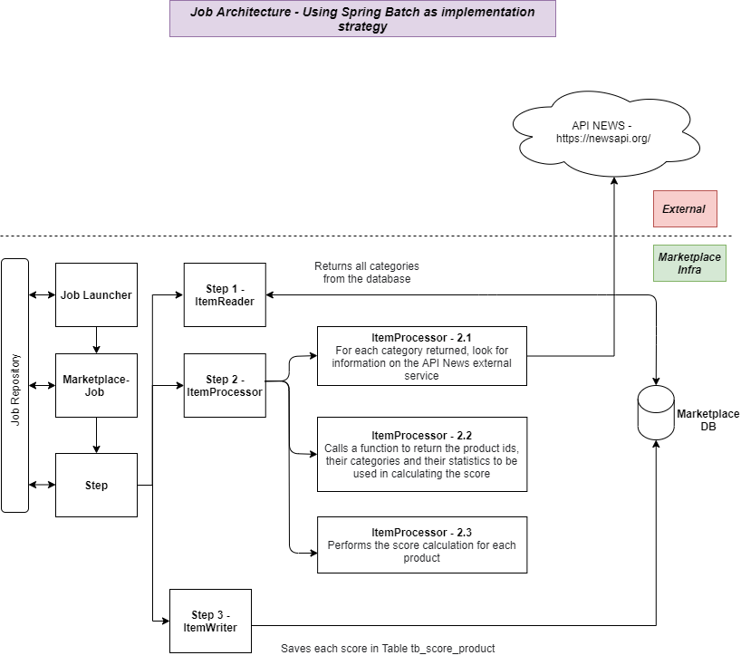

# DESAFIO-HOTMART-JOB

 As variáveis necessárias para o projeto estão no arquivo de configurações do spring em: 
<strong> src/main/resources/application.properties. </strong>

Apenas adicionar no Run configurations a API KEY própria para acessar o APINews ( <a> https://newsapi.org/ </a> ), propriedade: <strong>-DAPI_KEY_API_NEWS=TOKEN , após isso só rodar :) </strong>

 Necessário configurar o banco de dados, está configurado para utilizar my sql na porta 3306 

 Pode ser utilizado qualquer outro banco compatível com o JPA. Para continuar utilizando o MySQL seguir: 

 Configuração: Dentro da pasta sql/ existe um arquivo ( backup.sql ) que contem todas as tabelas configuradas para rodar o projeto.

 Dentro da pasta do MySql/bin (C:\Program Files\MySQL\MySQL Server 8.0\bin), para importar o banco, colocar o arquivo backup.sql dentro da pasta e rodar o comando:

 <strong><i>	> mysql -u root -p marketplace < backup.sql </strong></i> 

 Colocar a senha do usuário root do MYSQL . 

 * O banco de dados foi exportado utilizando o comando: 

 <strong><i>	> mysqldump -u root -p marketplace > backup.sql </strong></i> 

<h1>- Architecture Representation: </h1> 

<h1>- Funcionamento: </h1>

 Tecnologias: Java8 / Spring / Spring Data / Spring Batch / Apache Quartz

 Foi utilizado o Apache Quartz para realizar o gerenciamento de horários que o job deve rodar ( de 6 em 6 horas, parametrizado no arquivo de constantes <strong>com.hotmart.constants.JobConstants</strong>) 

 O job foi criado utilizando como base o framework Spring Batch e Apache Quartz. Basicamente pelo Spring Batch, há configuração do jobRepository, o JobLauncher e do Step que são os pontos básicos para se criar a base do Spring Batch. 

 Documentação de referencia do Spring Batch: <a>https://docs.spring.io/spring-batch/docs/current/reference/html/index.html</a>

<h1>- Etapas: </h1>

<strong> Reader:</strong> Etapa de leitura de categorias do banco de dados

<strong> Processor:</strong> Para cada categoria, pesquisa as principais noticias sobre ela, realiza o cálculo do score para cada produto que possui a categoria ( caso o produto contenha mais de uma categoria é calculado o score deste produto para cada categoria ) , utilizando: X (Quantidade de noticias da categoria) + Y (Quantidade de vendas/dias que o produto existe) + Z ( Média de avaliação do produto nos últimos 12 meses ) 

<strong> Writer:</strong> Etapa de salvar os scores calculados para cada produto ou atualizar o produto que já foi salvo, com o score da categoria que está sendo pesquisada no momento

